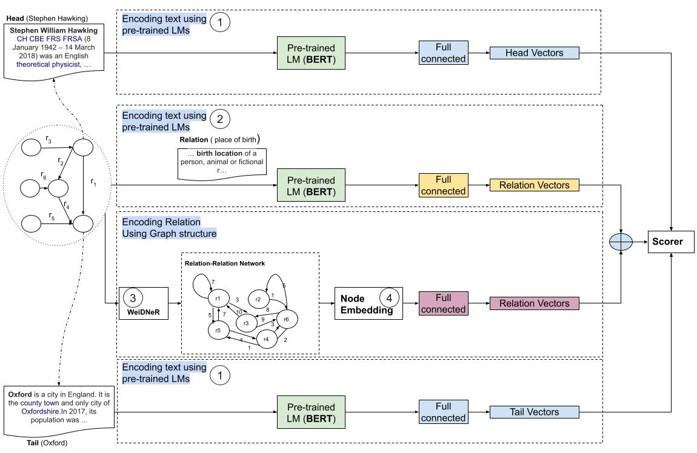

# RAILD: Towards Leveraging Relation Features for Inductive Link Prediction In Knowledge Graphs

## Acknowledgements

 - Some parts of RAILD are implemented by modifying/extending the [BLP](https://github.com/dfdazac/blp) implementation. We thank them for making their code available for reuse.

 
